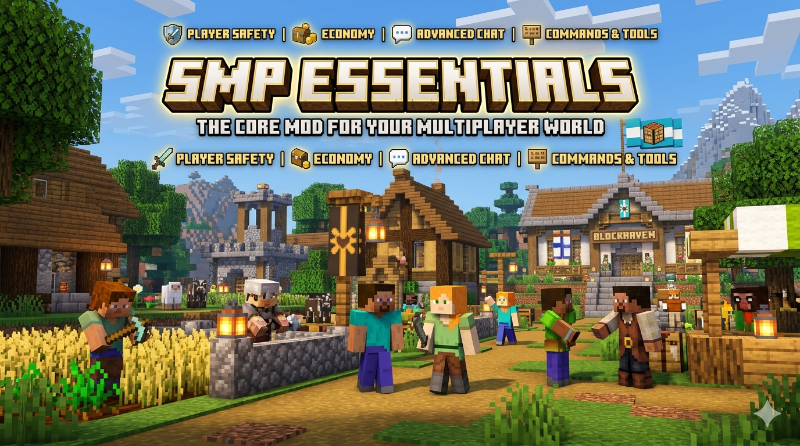

<div align="center">



# SMP Essentials

**De complete toolkit voor jouw Minecraft SMP** — valuta, winkels, een bank, jobs, een veilinghuis, land-claims, NPC-quests, bounties en quality-of-life commando's.


📖 [Bekijk de volledige wiki](https://sanderbloem050.github.io/SMP_Essentials/)

</div>

---

## ✨ Features

| | |
|---|---|
| 🪙 **Valuta** | Fysieke koper/zilver/goud-munten met een vaste wisselkoers (1g = 9s = 81c) |
| 👛 **Wallet** | Persoonlijke rekening — `/balance`, `/pay`, `/deposit`, `/withdraw` |
| 🏦 **Bank-blok** | Craftbaar ATM-blok om je wallet te beheren zonder commando's |
| ⛏️ **Jobs** | Verdien automatisch munten met minen en oogsten |
| 🔨 **Veilinghuis** | Speler-tot-speler marktplaats met klikbare chat-knoppen |
| 🏪 **Shopkeeper-NPC** | Instelbare winkel met kist-voorraad, koop- én verkoopmodus, eigen GUI en vanilla handelsscherm |
| 🎁 **Loot Crates** | Schatkisten die je met een sleutel opent voor willekeurige beloningen |
| 🏡 **Land & Claims** | Claim chunks, bescherm tegen grief, trust voor vrienden, zichtbare grenzen |
| 🧭 **Quality of Life** | Homes, warps, `/spawn`, teleport-verzoeken (`/tpa`), `/back` en death-chests |
| 🎯 **Bounties** | Zet een prijs op iemands hoofd, win 'm terug in PvP |
| 📜 **NPC-Quests** | Quest-NPC's die items innemen voor een beloning op je wallet |
| 🗺️ **Quest Seeker** | Een schatzoeker-NPC die ergens random in de wereld verstopt wordt — wie hem vindt incasseert |
| ⚙️ **Server-instellingen** | GUI-venster voor OP's om mod-onderdelen aan/uit te zetten (`/smpadmin`) |

## 🚀 Installatie

1. Installeer [Fabric Loader](https://fabricmc.net/) voor Minecraft **26.1.2**.
2. Download en plaats in je `mods`-map:
   - [Fabric API](https://modrinth.com/mod/fabric-api) (versie `0.149.1+26.1.2` of nieuwer)
   - `smpessentials-<versie>.jar`
3. Start de game. Klaar!

## 🛠️ Zelf bouwen

Vereisten: **JDK 25**, Gradle wrapper is meegeleverd.

```bash
git clone <repo-url>
cd currency-mod-fabric
./gradlew build
```

De gebouwde jar staat na het builden in `build/libs/`.

## 📂 Projectstructuur

```
src/main/java/com/sanderbloem/currencymod/
├── data/        wallet (SavedData)
├── economy/     veilinghuis + bounties
├── claims/      land-claims + chunk-randen
├── qol/         homes / warps / locaties / back / death-chest
├── jobs/        mining & farming beloningen
├── config/      server-instellingen (aan/uit-schakelaars)
├── entity/      shopkeeper- en quest-NPC
├── block/       bank- en loot-crate-blok
├── menu/        custom GUI's (admin-shop, bank, instellingen)
├── client/      renderers & schermen
├── commands/    alle /commando's
└── loot/        muntendrops in loot tables
```

## ⌨️ Belangrijkste commando's

<details>
<summary>Klik om alle commando's te tonen</summary>

**Wallet**
- `/balance`, `/deposit`, `/withdraw <bedrag>`, `/pay <speler> <bedrag>`

**Jobs**
- `/jobs` — overzicht van mining/farming-beloningen

**Veilinghuis**
- `/ah`, `/ah sell <prijs>`, `/ah buy <id>`, `/ah mine`, `/ah cancel <id>`

**Shopkeeper**
- `/shopkeeper spawn|addtrade|removetrade|setname|remove`

**Homes & warps**
- `/sethome`, `/home`, `/delhome`, `/homes`
- `/warp`, `/setwarp`, `/delwarp`, `/warps`
- `/spawn`

**Teleport**
- `/tpa`, `/tpahere`, `/tpaccept`, `/tpdeny`

**Claims**
- `/claim`, `/unclaim`, `/claims`, `/claim show`
- `/trust <speler>`, `/untrust <speler>`

**Back**
- `/back` — naar vorige locatie of sterfplek

**Bounties**
- `/bounty set <speler> <bedrag>`, `/bounty list`

**Quests**
- `/questgiver spawn|setitem|setreward|toggleonce|remove`
- `/questseeker spawn <straal> <beloning>`, `/questseeker remove` (OP)

**Admin**
- `/smpadmin` — server-instellingenvenster (OP)

</details>

Volledige uitleg, voorbeelden en GUI-screenshots: zie de [wiki](https://sanderbloem050.github.io/SMP_Essentials/).

## 🗺️ Roadmap

- [x] Munten, wallet, bank, jobs
- [x] Shopkeeper-NPC met kist-voorraad
- [x] Veilinghuis
- [x] Land-claims met zichtbare grenzen
- [x] Homes, warps, spawn, tpa, `/back`, death-chest
- [x] Loot crates, bounties & NPC-quests
- [x] Server-instellingenvenster (`/smpadmin`)
- [x] Koop-én-verkoop-shops (SELL + BUY mode per artikel)
- [ ] Server-brede events

## 📜 Licentie

MIT — zie [LICENSE](LICENSE).

---

<div align="center">Gemaakt door <b>Sander Bloem</b></div>
